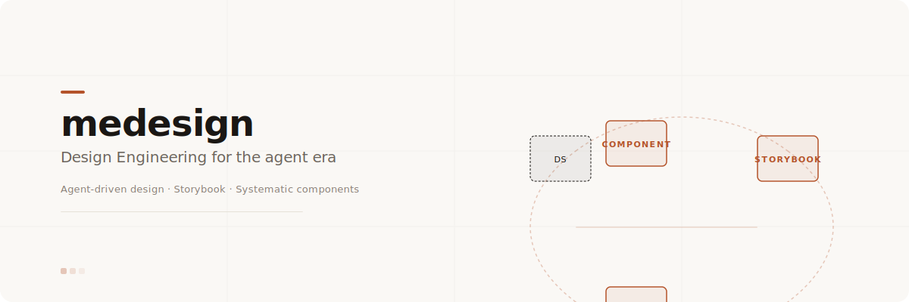
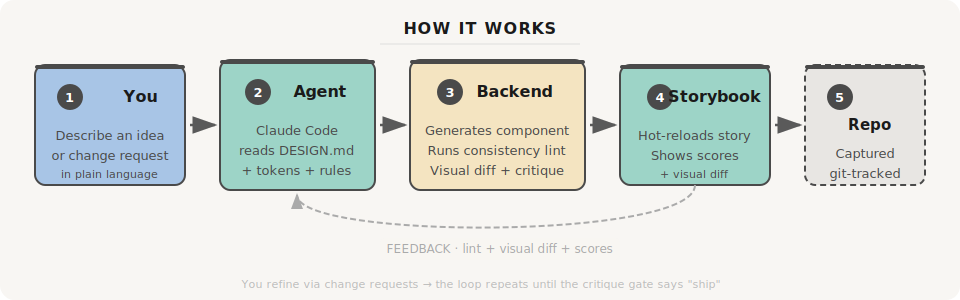
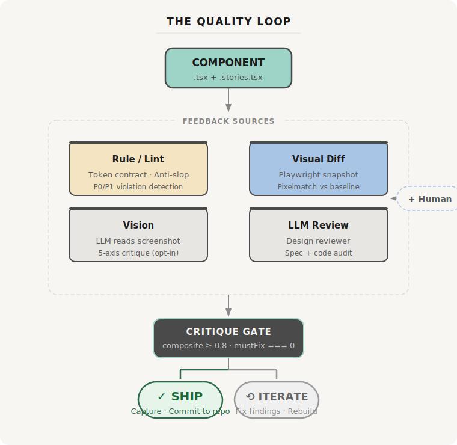
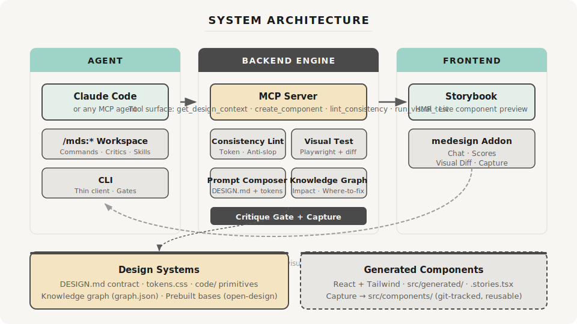
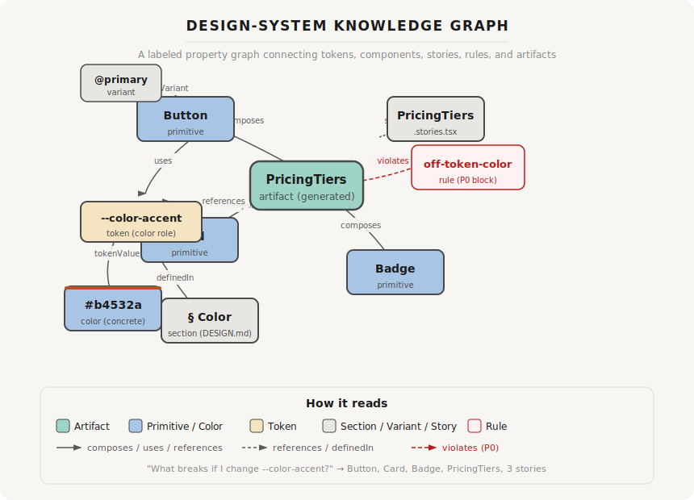

<p align="center">
  
</p>

<p align="center">
  <b>Design Engineering for the agent era.</b><br>
  Turn an idea into a beautiful, on-system, reusable React component —<br>
  through a live agent-driven design loop you can see, critique, and improve.
</p>

<p align="center">
  <a href="#quickstart"><b>Try it in 30 seconds</b></a> ·
  <a href="docs/QUICKSTART.md">Quickstart</a> ·
  <a href="docs/architecture.md">Architecture</a> ·
  <a href="docs/README.md">Docs</a> ·
  <a href="docs/CONTRIBUTING.md">Contributing</a>
</p>

<p align="center">
  <a href="LICENSE"></a>
  <a href="https://storybook.js.org/"></a>
  <a href="https://claude.ai/code"></a>
</p>

---

## What is this?

medesign is a **design-engineering engine** — a headless Studio backend that powers **Storybook as
your front-end design surface**. You describe an idea; an agent turns it into a reusable,
visually-tested React component that matches your design system exactly.

```
"You: a pricing section with three tiers, highlight the middle one"
    │
    ▼
  agent (Claude Code) reads your DESIGN.md + tokens + primitives
    │
    ▼
  writes on-system <PricingTiers /> + CSF story → Storybook hot-reloads
    │
    ▼
  you see it, critique it, change it, ship it → committed to your repo
```

No Figma handoff. No design-system drift. No one-off AI-slop components.

> **Think of it as "vibe design" with a quality engine:** you keep the conversational flow of
> describing what you want, but every output is verified — consistency-linted, visually diffed,
> critique-scored — and lands as maintainable React+Tailwind code in your repo.

## Who is this for?

- **Solo founders / indie hackers** who want UI that looks designed, stays on-system, and drops into
  the codebase as reusable components — without being a designer or hiring one.
- **Vibe-coders** who've tried prompting for UI and gotten "looks kinda like Bootstrap 2015" —
  medesign adds a DESIGN.md contract + a consistency lint + a visual diff gate that pushes output
  from generic to deliberately designed.
- **Teams that already use Storybook** — drop medesign in (`medesign attach`) and your design system
  becomes an agent-driven quality surface instead of a static library page.

## Quickstart

```bash
npm install && npx playwright install chromium   # one-time
npm run studio    # → http://localhost:6006       (Storybook + medesign panel)
npm run backend   # → http://localhost:4321       (HTTP bridge + MCP for agent)
```

**Then in Claude Code (or any MCP agent):**

Connect your agent to the backend via `.mcp.json`, and ask:

> *"Build a pricing section with three tiers, highlight the middle one."*

The agent reads your design system, writes code, and Storybook hot-reloads it — linted, diffed, and
ready to refine. Full walkthrough: [`docs/QUICKSTART.md`](docs/QUICKSTART.md).

## Why medesign?

| This vs | medesign |
|---|---|
| **Prompting ChatGPT/Gemini for HTML** | You get a reusable React component + CSF story, committed to your repo — not one-off HTML you paste and lose |
| **open-design** (the pioneer) | Medesign adopts its DESIGN.md contract + critique gate, then **beats it** — deterministic visual tests replace LLM juries, and you get code‑first components instead of embedded HTML |
| **Hand-rolling components** | The agent does the writing; you do the critiquing. Four feedback sources (lint, visual diff, LLM vision, LLM review) catch what a solo developer would miss |
| **AI-slop generators** | A **consistency lint** blocks indigo gradients, emoji in headings, invented metrics, and off-token colors — the exact things that scream "AI made this" |
| **Figma → code tools** | You stay in code the whole time — no handoff, no export step, no drift between design and implementation |

## How it works



Each refinement is a change request → diff → instant re-render → snapshot vs baseline. "Works
smoothly" = visually verified + lint-clean. See [`docs/architecture.md`](docs/architecture.md).

### The quality loop

Every component goes through **four independent feedback sources** before shipping:



See [`docs/harness-engine.md`](docs/harness-engine.md).

### System architecture



## Repo layout

```
.claude/          WORKSPACE: commands · agents · skills · workflow engine · gates
docs/             spec · architecture · harness-engine · quickstart · contributing
design-systems/   atelier/ DESIGN.md (9 sections) + tokens.css + code/ primitives
                  · _vendor/open-design/ — 13 prebuilt bases to import-and-customize
skills/           web-section/ + _vendor/open-design/ (159 vendored skills, Apache-2.0)
scripts/gates/    lint.sh · visual.sh · build.sh (exit code = verdict)
packages/
  cli/            CLI (`medesign`): agent + gates invoke this
  backend/        Headless engine: MCP · lint · visual test · critique gate · capture
  graph/          Knowledge graph: where-to-fix · impact · consistency brief
  addon/          Storybook panel: chat · scores · capture · diff
  dsr/            Design-system runtime: aggregates · rule engine · validation
  doctor/         Production-readiness linting: X/Y rules passed
  mcp-server/     MCP tool surface for agents
  vision-critic/  LLM vision critique (Claude, Gemini, Minimax)
  plugin-api/     Plugin contract interface
  plugin-core/    Universal always-on rules
  plugin-css/     CSS → graph parsing + doctor rules
  plugin-react/   React renderer (.tsx + CSF stories)
  plugin-tailwindcss/  Tailwind CSS adapter
  plugin-shadcn/  shadcn/ui component guidance
apps/
  workspace/        Abstract init/attach installer + framework registry
  workspace-react/  Storybook dogfood instance + init templates
```

> **Portable + opt-in + framework-agnostic.** Drop medesign into any project that already has
> Storybook (`medesign attach`) or scaffold a new one (`medesign init <framework>`). The engines
> stay in `packages/*`; only a `FrameworkAdapter` is per-framework (React implemented;
> Vue/Svelte/web-components/Angular stubbed). See [`docs/workspace.md`](docs/workspace.md).

## Two flows

Every project starts from a **design system**, then you **craft** against it:

- **Design System** — [`/mds:system:create`](docs/workspace.md) (brief/blank/import/extract) · `:update` · `:use`.
  Start from a prebuilt base: `medesign ds create noir import atelier` clones a known-good system to
  customize. See [`docs/authoring-design-systems.md`](docs/authoring-design-systems.md).
- **Craft** — [`/mds:craft:component`](docs/harness-engine.md) · `:view` · `:story` · `:update`.
  Shared: `/mds:review`, `/mds:vision`, `/mds:ship`.

## Why it produces good design

Quality comes from the **DESIGN.md contract** — an opinionated, exact, 9-section spec the agent
builds *from*, plus a **consistency lint** that blocks AI-slop (indigo gradients, emoji icons,
invented metrics, off-token color…) and a **critique gate** that won't let a component pass on a
great average while a blocking issue remains. See [`docs/authoring-design-systems.md`](docs/authoring-design-systems.md)
and [`docs/open-design-analysis.md`](docs/open-design-analysis.md).

## Knowledge graph

`@medesign/graph` encodes the whole design system as a **labeled property graph** (files, stories,
components, tokens, colors, fonts, specs, rules, themes — each with `file:line` provenance). It
powers *where-to-fix* localization, *impact propagation* ("what breaks if I change
`--color-accent`?"), and *consistency briefs* for building new on-system components.



See [`docs/data-model.md`](docs/data-model.md) for the full node/edge specification and query intents.

## Roadmap

| Phase | What's built | Next |
|---|---|---|
| 0 (MVP) | MCP tools, consistency lint, visual test, critique gate, capture, addon panel, Atelier DS | → |
| 1 | ☑ Knowledge graph | Agent self-correction loop, click-to-edit, Storybook graph viewer |
| 2 | — | Bulk design-system importer, baseline management, multi-framework CI |

## Contributing

Contributions are welcome! See [`docs/CONTRIBUTING.md`](docs/CONTRIBUTING.md) for three contribution paths:
design systems, skills, and agent adapters. All contributors must follow our
[Code of Conduct](CODE_OF_CONDUCT.md).

## Credits

Design and code patterns adapted from [open-design](https://github.com/nexu-io/open-design)
(Apache-2.0). Includes 159 vendored skills from the open-design ecosystem. See
[`NOTICE`](NOTICE) and [`docs/open-design-analysis.md`](docs/open-design-analysis.md).

## License

[Apache 2.0](LICENSE). Copyright 2026 the medesign authors.
